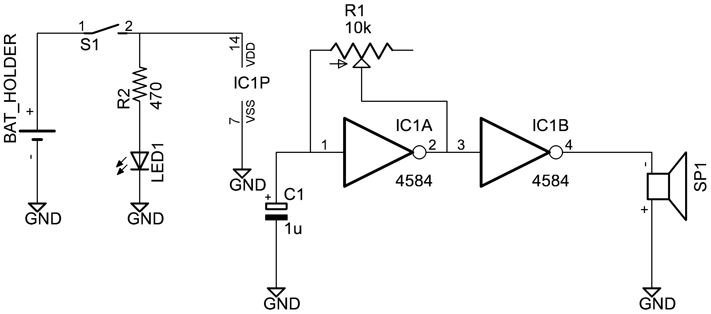

# CMOS野郎
## 説明
CMOS野郎はシュミットトリガインバータ(4584)を使った発振器と、スピーカーを組み合わせた、電池で動くシンプルな楽器です。

## 基本的な使い方
- スイッチを上にスライドさせると、LEDが点灯、音が鳴ります。
- 手前にあるツマミを回すと、ピッチが変わります。

## 応用的な使い方
- 回路がむき出しになっているので、あちこち触ってみると面白いです。
    - 電池のあたりを触るとザリザリします。
    - ツマミの裏辺りを触ると微妙にピッチが変わります。上手くやるとビブラートもできます。
    - スピーカーの穴を指でふさいだりすると、微妙にフィルターがかかります。
- 複数使うと、うなり(beat)が作れて面白いかもしれません。

## 交換が必要な部品
電池は **CR2032** を使って下さい。

## デモ曲
- 同梱のCDに入っています。CMOS合唱団「Our Beat」
- [同じものがsoundcloudにもあります。http://bit.ly/1OMm2iN](http://bit.ly/1OMm2iN)

\newpage

## 回路
かなり簡単です。

